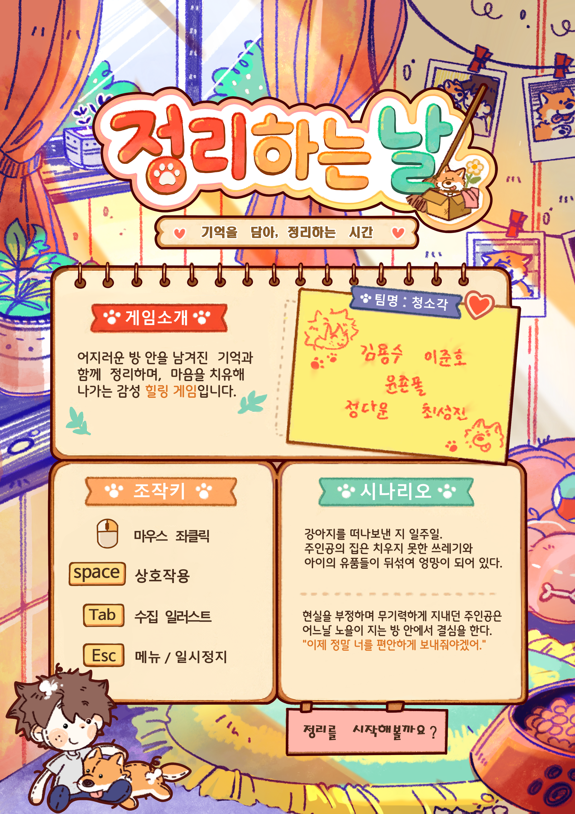
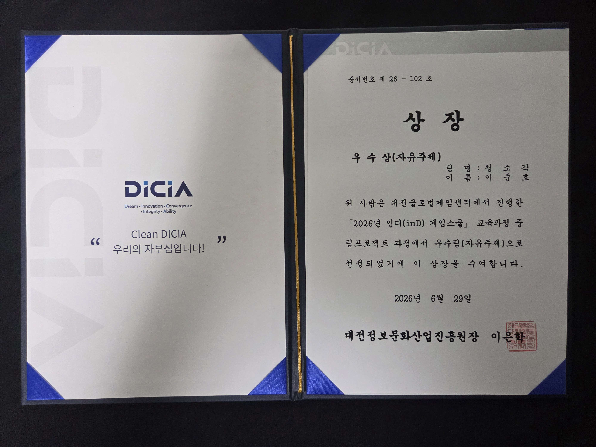
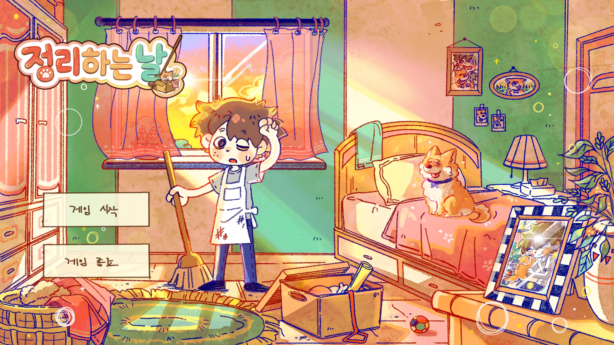
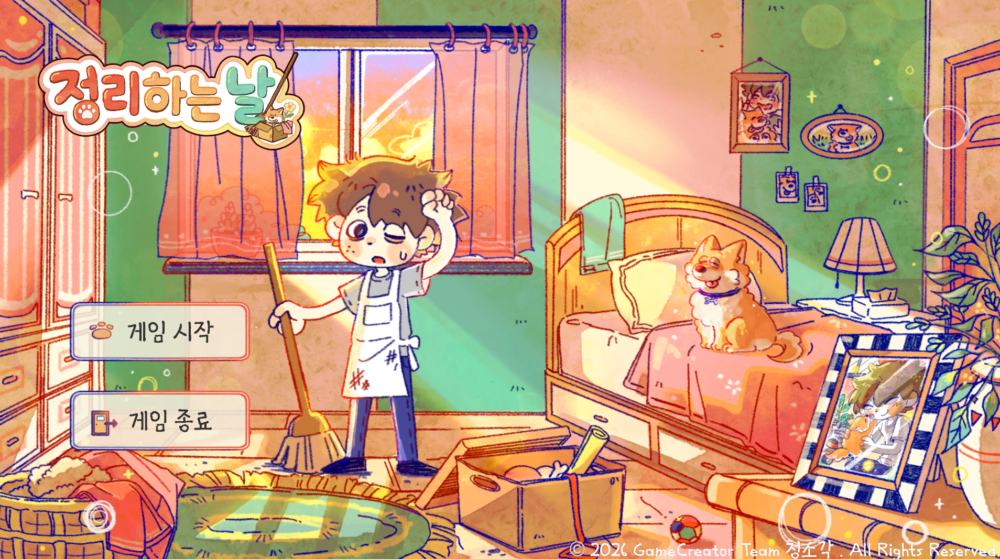

# 정리하는 날

## ⚠️ 들어가기 앞서

해당 Repository는 README.md 수정을 위해 기여했던 본래 프로젝트에서 import한 사본입니다. 
원본 Repository는 오른쪽 링크를 참고해주세요. 👉  

## 📌 게임 소개

- 프로젝트 개발 기간 : 2026.04 ~ 2026.06
- 장르 : 포인트 앤 클릭
- 플랫폼 : PC
- 팀원 : 개발 2명, 그래픽 2명, 기획 1명
- 비고 : 해당 프로젝트에서 **메인 게임 프로그래머** 입니다.

## 📖 게임 설명

**< 기억을 담아, 정리하는 시간 >**

자신의 반려견을 세상에서 떠나보내고 그리워하던 주인공. 
어질러진 자신의 방을 보고 주인공은 강아지와의 추억을 정리하고 다시 세상을 나아가려합니다. 
강아지와의 추억이 담긴 각종 미니 게임을 해결해 나가며 주인공과 함께 추억을 정리하세요.

## 📓 게임 패널

## 🎬 플레이 영상

- &nbsp; 

## 📄 담당 업무

### 시스템
- 게임 플레이 루프 설계
  - 모든 씬들 간의 이동
  - 미니게임 트리거
- 인트로 책 씬
  - 비고 : 에셋의 활용
- 각 미니 게임이 순서대로 상호작용할 수 있도록 구현
- 타이틀 화면

### 미니 게임
- 장난감 공 미니 게임 전체
  - 공을 던지는 로직 구현
    - 공은 정해진 각도로 던져짐
    - 스페이스 바로 던지는 힘을 조절 가능
    - 도착 지점을 미리 예측하며 보여주는 가이드 기능
  - 강아지가 공을 물어오는 로직 구현
  - 강아지와 주인공의 애니메이션 구현
   
- 터그 미니 게임 전체
  - 강아지와 힘싸움하는 로직 구현
    - 스페이스 바의 입력에 따라 강아지와 주인공이 힘겨루기
    - 스페이스 바 입력에 따라 게이지 변화
    - 게이지의 값에 따라 강아지와 손의 위치 변경
    - 강아지와 주인공의 손이 힘겨루기를 하고 있는 듯 연출하기 위한 회전 값 구현
   
- 샴푸 미니 게임 전체
  - 강아지를 목욕시켜주는 로직 구현
  - 샴푸 / 샤워기 / 타월의 상호작용 구현
  - 각 소품들을 클릭하고 마우스 좌클릭을 누르면서 강아지를 문지르면 게이지가 증가하는 기능
  - 샤워기 한정으로 문지르지 않아도 게이지가 증가하는 기능
  - 샤워기를 오래 틀 수록 씬 내의 물이 많아지는 기능
  - 선택해야할 소품의 테두리를 하이라이트로 강조하는 기능
    - 비고 : 쉐이딩 + AI 에이전트의 도움
  - 강아지가 각 소품에 맞게 애니메이션이 변경되는 기능

### 주인공의 방
- 주인공 방에서 소품을 상호작용해서 미니게임으로 넘어가는 기능
- 추억 상자
  - 추억 상자와 상호 작용
  - 추억 상자 인터페이스 안의 소품과 상호작용하면 발생하는 기능 전체

### 연출
- 전체적인 사운드 관련 기능
- 인트로 책 씬의 애니메이션
  - 비고 : 쉐이딩 + AI 에이전트의 도움
- 씬이 전환될 때 페이드 연출되는 기능
- 추억 상자 클릭을 가이드하는 하이라이트
  - 비고 : 쉐이딩 + AI 에이전트의 도움
- 게임의 진행도에 따라 주인공의 방 색감이 변하는 기능
- 게임의 진행도에 따라 주인공의 방에서 들리는 배경음이 억제되는 연출
- 각 미니 게임의 가이드 텍스트 기능
  - 비고 : 담당하지 않은 미니 게임을 포함한 모든 미니 게임
- 각 미니 게임이 끝날 때 컷씬과 함께 따뜻한 문구 출력
  - 비고 : 담당하지 않은 미니 게임을 포함한 모든 미니 게임

### 기타
- 연출 부분에 적혀있지 않은 주요 폴리싱 작업
- 그래픽 디자이너들과 개발자들과의 소통 및 조율
- 다음 미니게임에 대한 아이디어 제시
  - 장난감 공
  - 추억 사진

## 🎖️ 결과

🏆 2026 대전 게임 인디 스쿨 : 우수상 (자유주제)
- 2026 대전글로벌게임센터에서 진행한 인디 게임 스쿨의 팀 프로젝트 과정에서 우수팀으로 선정되어 수상

 

 ---
 
 

## 💡 프로젝트를 통해 얻은 경험
- **Observer Pattern**
- **그래픽 디자이너와 직접 소통하며 개발**
- **그래픽 작업물로 발생한 문제 해결 경험**

## 🔋 개발 동기

2026년 대학교 수업 이외에 대외 활동을 하고 싶었습니다. 캡스톤 프로젝트를 진행하기 전까지는 그래픽 디자이너와 따로 협업을 해본 경험이 없었고, 저희 대학교 이외에 다른 대학교들과도 만남을 가져보고, 협업을 해보고 싶었기 때문입니다. 이번 프로젝트의 그래픽 디자이너는 타 학교 사람들이었고, 처음에는 낯설었지만 무사히 개발을 마치고 수상까지 받을 수 있는 값진 경험이 되었습니다.
 
게임 주제를 감성 게임으로 잡은 것은, 이번 프로젝트의 공통 주제가 `기능성 게임`이었기 때문입니다. 이 <게임 인디 스쿨>에 참여한 각 팀들은 대부분 `수리`라는 키워드를 선택했지만, 저희 팀은 이러한 키워드는 식상하다고 느꼈습니다. 저희 팀 그래픽 디자이너가 타 팀에 비해 뛰어난 그림 실력과 귀여운 그림체를 잘 그린다는 특징을 이용하여, "이것을 감성 게임에 잘 접목해보면 좋은 무기가 되지 않을까?"라고 생각하게 되었습니다. 그렇게 저는 이번 프로젝트에서 지금까지의 프로젝트들처럼 주인공이 되기 위해 빛나려 하지 않고, 그래픽 디자이너들의 후광이 되어주기로 생각하며 게임을 개발하게 되었습니다.

## ❓ 문제 해결 및 개선

### Q1. 소품과 미니게임의 문제
감성 게임이라는 어려운 주제를 잡은 만큼 소품의 구성, 그리고 그 소품에 알맞는 미니게임을 구상했습니다. 하지만 멘토님께서는 감성 게임에는 개발자가 플레이어의 생각을 강요하면 안되는게 중요하다고 하셨습니다. 또한 승부를 한다고 느낀다거나, 몽글한 감정이 깨지는 행동 자체도 최대한 피해야한다고 하셨습니다. 처음에 다양한 소품들에 대한 회의가 오갔고, 그 회의로 결정된 소품들 사이에서도 다양한 미니게임 의견이 오갔습니다. 그렇게 결정된 미니 게임은 현재와 같은 구성이 되었습니다.
 
하지만 막상 개발해보고, 미니 게임이 플레이어의 감정 몰입을 헤친다 싶으면 바꾸고, 구성품을 바꾸고를 반복하다 보니 소품과 연결되는 미니 게임이 변경되더라도 상호작용 코드를 크게 수정하지 않는 구조가 필요하다고 생각했습니다.

### A1. 해결 방법
Interface를 사용했습니다. 각 미니 게임으로 연결할 소품들은 [IPropsEvent](https://github.com/Byeo1ha/CleanupDay/blob/main/Assets/Scripts/PlayerRoom/Event/IPropsEvent.cs)를 구현하게 하고, 미니 게임으로 연결한 스크립트는 각 소품의 클래스를 참조하고 실행하는 것이 아닌 IPropsEvent 인터페이스에게 요청하여 `Play`함수를 실행하는 구조로 설계하였습니다.

 

### Q2. 그래픽 파일의 문제
감성 게임이라는 특징은 지금까지 만든 게임보다 폴리싱 작업이나 연출 부분에서 더 힘을 줘야한다고 생각했습니다. 좋은 개발자는 코드를 잘치고, 구조 설계를 잘해야하는 것도 맞지만, 게임의 마감을 얼마나 부드럽게 하고, 자연스럽게 하며, 사용자가 그 게임을 보고 불편하다는 생각이 없어야한다고 생각합니다. 하지만 그래픽 디자이너에게 파일을 받고 Unity로 구현을 했을 때 문제를 마주했습니다. 

  <table>
    <tr>
      <td align="center">
         
        그래픽 디자이너가 보낸 포토샵 이미지
      </td>
      <td align="center">
         
        실제 Unity에 적용된 이미지
      </td>
    </tr>
  </table>

Unity로 구현된 이미지는 그래픽 디자이너가 보내준 가이드 사진과 다르게 색감이 조금 더 옅어보였던 문제가 있었습니다. 디자이너가 의도한 바를 게임에 담지 못하는 것은 제가 용납할 수 없었습니다. 파일의 확장명을 바꿔보기도 했고, Unity 내 Inspector 창에서 해당 사진의 속성을 수정해보기도 했습니다. 그 이유는, 윈도우 뷰어로 사진을 보거나, Google Drive를 통해 확인했을 때는 분명 디자이너가 보내준 색감이랑 동일했지만, Unity 내에서만 색감이 옅게 보였던 것입니다.
 
### A2. 해결 방법
원인을 확인해보니 전달받은 이미지의 색상 프로파일이 `Display P3`로 설정되어 있었습니다. 해당 파일을 Unity에서 불러왔을 때 원본과 색감 차이가 발생했고, 이미지의 색상 프로파일을 `sRGB`로 변환한 뒤 다시 적용하자 원본과 유사한 색감으로 표시되었습니다.

## ✍️ 개발하면서 느낀 점

기술적으로는 다른 프로젝트보다 어려움이 적었지만, 그래픽 디자이너와 협업하는 과정에서 이전에는 겪어보지 못한 문제들을 새롭게 경험했습니다.
 
뿐만 아니라, 이번 게임은 기획자 1명이 있긴 했지만, 다 같이 기획한 게임이었습니다. 그래서 그런지, 저의 의견 하나 하나가 게임에 직접 반영되어 하나의 게임이 완성되어가는 과정을 보고 뿌듯하기도 했습니다.

이 게임을 발표할 때 평가자들은 "그래픽이 훌륭하다."와 같이 그래픽에 관련된 칭찬이 무척 많았습니다. 처음에는 솔직히 서운했습니다. 게임의 연출 하나 하나를 세심하게 신경쓰고, 거칠지 않게 표현하면서, 자연스럽게 보여주도록 노력을 무척 했습니다. 비록 코드의 난이도는 낮을지 언정 많은 노력을 기울였지만 돌아오는 게임의 평가는 "그림체가 귀엽다."와 같은 디자이너들의 칭찬 뿐이었습니다. 하지만 시간이 지나고보니, 사용자들이 불편하지 않고 그래픽에 온전히 몰입하고, 감성 게임으로써의 역할을 제대로 수행해냈다는 것이 개발자들의 노력이 그래픽의 후광으로써 비춰주는 하나의 역할이었다고 생각하게 되었습니다.

그 경험을 통해, 플레이어가 구현을 의식하지 않을 정도로 자연스럽게 동작하고 그래픽과 연출에 몰입할 수 있게 만드는 것 역시 개발자의 역할이라는 생각하게 되었습니다.

 

 ---
 
 

 ## 📚 사용 에셋

- Book - Page Curl 👉 

## 🎵 사운드

- Google Gemini를 통해 생성된 AI 배경 음악 및 효과음